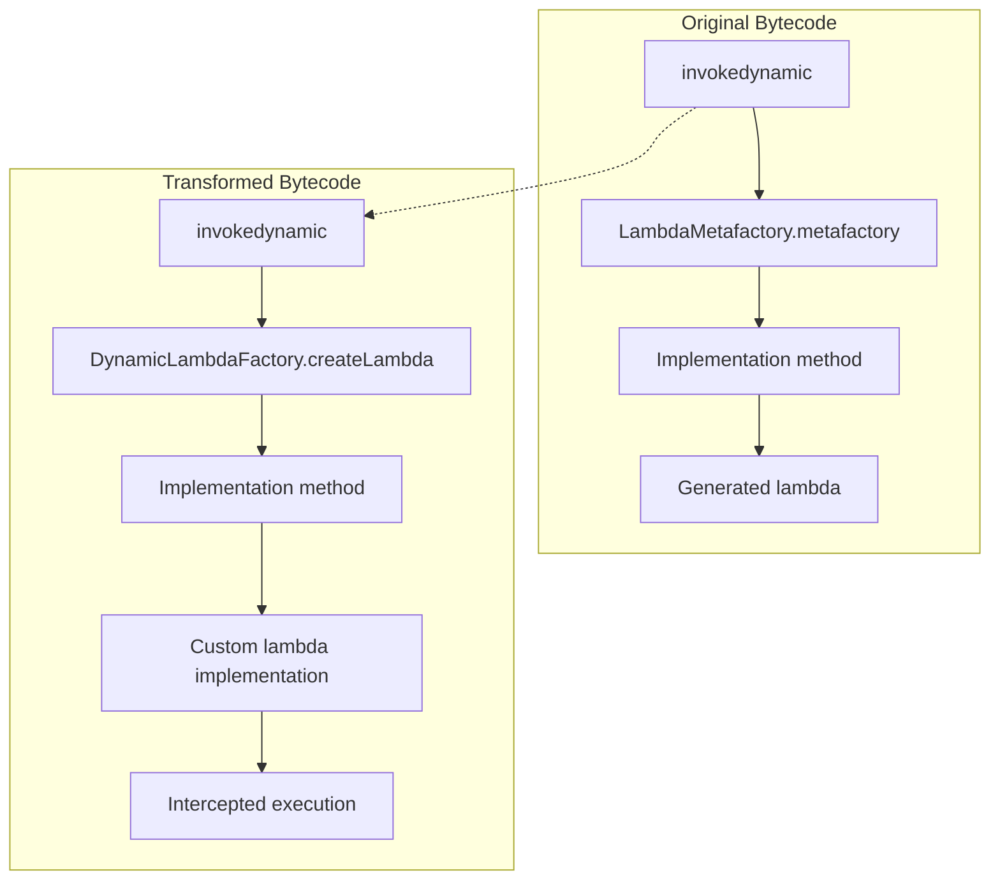

# Lambda Handles
This project is a POC for working with bytecode using ASM bytecode manipulation library and bytebuddy.

## Bootstrap Interceptor
The Bootstrap Interceptor is our entry point into the JVM's class loading process. It registers a Java agent that intercepts classes as they're loaded, examining and modifying their bytecode before execution.

When a class is loaded:

1. The JVM calls our registered transformer
2. We examine the bytecode using ASM
3. We identify invokedynamic instructions linked to the standard LambdaMetafactory
4. We replace the bootstrap method handle with our custom factory
5. The modified bytecode is loaded by the JVM

## Dynamic Lambda Factory

The Dynamic Lambda Factory is responsible for creating custom implementations of lambda expressions. When our modified bootstrap method is invoked, the JVM calls our factory instead of the standard LambdaMetafactory.

Our factory:
1. Analyzes the functional interface to find the Single Abstract Method (SAM)
2. Generates a new class implementing that interface using ByteBuddy
3. Intercepts method calls to the interface
4. Delegates to the original implementation logic
5. Returns a constant call site with our custom implementation

This is how it works with DynamicLambdaFactory. 

